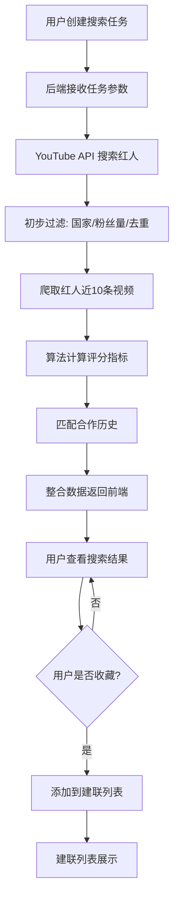

# 红人搜索系统 - 数据流转文档

> **版本**: v1.0  
> **更新日期**: 2026-01-27  
> **文档类型**: 技术架构 - 数据流转

---

## 📋 文档概述

本文档详细描述红人搜索系统从任务创建到建联管理的完整数据流转过程，包括前端交互、后端处理、算法计算和数据存储的各个环节。

---

## 🔄 完整数据流转图



---

## 📊 详细流程说明

### 阶段 1: 任务创建 `[前端 → 后端]`

#### 1.1 用户操作
用户在前端填写任务创建表单，包含以下信息：

**基本信息**:
- 任务名称
- 行业关键词（必填）
- 本品关键词（必填）
- 竞品关键词（必填）

**搜索配置**:
- 单个关键词搜索视频数
- 排序方式（相关性/观看次数/发布日期）
- 目标国家（必填，多选）
- 搜索维度（按视频/按频道）
- 粉丝数区间（可选）

**目标画像**:
- P0 频道类型（必填）
- P1 频道类型（必填）
- P2 频道类型（必填）

#### 1.2 数据传输
**请求接口**: `POST /spider/youtube/search`

**请求参数示例**:
```json
{
  "execute_type": "channel_search",
  "project_id": 1,
  "task_name": "Q1科技产品红人搜索",
  "keywords": "智能家居,IoT,AI设备",
  "brand_name": "品牌A,产品X",
  "competing_product": "品牌B,品牌C",
  "video_max_result": 50,
  "order": "relevance",
  "prefer_country": "US,GB",
  "channel_search_type": "video",
  "min_subscribers": 10000,
  "p0_channel_types": "科技评测,开箱",
  "p1_channel_types": "生活方式,DIY",
  "p2_channel_types": "通用科技,新闻"
}
```

#### 1.3 后端处理
1. **验证任务名称唯一性**（同项目下不能重复）
2. **保存任务参数**到数据库（`spider_record` 表）
3. **生成任务 UUID**
4. **设置任务状态**为 `init`（初始化）
5. **返回任务 UUID**给前端

**响应示例**:
```json
{
  "code": 200,
  "msg": "任务创建成功",
  "data": {
    "uuid": "ba8c51484269428ba8b0e69582ebf837",
    "taskName": "Q1科技产品红人搜索",
    "status": "init"
  }
}
```

---

### 阶段 2: 关键词搜索红人 `[后端 → YouTube API]`

#### 2.1 搜索策略
后端根据任务参数调用 YouTube Data API v3 进行搜索：

**搜索逻辑**:
1. **拆分关键词**：将行业关键词按逗号分隔
2. **组合搜索**：每个关键词 + 本品关键词/竞品关键词组合搜索
3. **批量请求**：并发调用 YouTube API
4. **结果聚合**：合并所有搜索结果

**YouTube API 调用示例**:
```
GET https://www.googleapis.com/youtube/v3/search
?part=snippet
&q=智能家居+品牌A
&type=video
&maxResults=50
&order=relevance
&regionCode=US
```

#### 2.2 数据提取
从 YouTube API 响应中提取：
- 视频ID
- 频道ID（channelId）
- 频道名称（channelTitle）
- 视频标题
- 发布时间

#### 2.3 去重处理
- 按 `channelId` 去重，避免同一频道重复
- 记录每个频道匹配的关键词

**中间数据结构**:
```json
{
  "channelId": "UCxxxxxx",
  "channelTitle": "Tech Review Pro",
  "matchedKeywords": ["智能家居", "品牌A"],
  "videoIds": ["vid1", "vid2", "vid3"]
}
```

---

### 阶段 3: 过滤红人 `[后端数据处理]`

#### 3.1 获取频道详细信息
调用 YouTube API 获取频道的完整信息：

**API 调用**:
```
GET https://www.googleapis.com/youtube/v3/channels
?part=snippet,statistics,contentDetails
&id=UCxxxxxx,UCyyyyyy,UCzzzzzz
```

**提取字段**:
- `snippet.title` - 频道名称
- `snippet.description` - 频道简介
- `snippet.thumbnails.default.url` - 头像
- `snippet.country` - 国家
- `statistics.subscriberCount` - 粉丝数
- `statistics.videoCount` - 视频数
- `statistics.viewCount` - 总观看次数

#### 3.2 多维度过滤

**过滤条件 1: 国家筛选**
```python
if channel.country not in prefer_country:
    continue  # 跳过不符合国家要求的频道
```

**过滤条件 2: 粉丝数筛选**
```python
if min_subscribers and channel.subscriberCount < min_subscribers:
    continue  # 跳过粉丝数不足的频道
```

**过滤条件 3: 去重筛选**
- 检查频道是否在项目的排除列表中
- 检查频道是否在之前的搜索任务中已出现

**过滤条件 4: 粉丝量级分类**
根据粉丝数自动分类：
```python
def classify_subscriber_level(count):
    if count > 10_000_000:
        return "MEGA"      # 超大型
    elif count > 5_000_000:
        return "TOP"       # 顶级
    elif count > 1_000_000:
        return "MACRO"     # 大型
    elif count > 500_000:
        return "MID_UP"    # 中上
    elif count > 100_000:
        return "MID"       # 中型
    elif count > 50_000:
        return "MICRO_UP"  # 微型偏上
    elif count > 10_000:
        return "MICRO"     # 微型
    else:
        return "NANO"      # 纳米
```

#### 3.3 过滤后数据
保存到数据库 `youtube_channel_info` 表：
```json
{
  "channelId": "UCxxxxxx",
  "channelTitle": "Tech Review Pro",
  "avatar": "https://...",
  "country": "美国",
  "subscriberCount": 1250000,
  "subscriberCntLevel": "MACRO",
  "videoCount": 450,
  "viewCount": 125000000,
  "avgViews": 278000,
  "matchedKeywords": "智能家居,IoT",
  "description": "专注于智能家居产品评测的科技频道"
}
```

---

### 阶段 4: 爬取视频并计算评分 `[后端 → 算法服务]`

#### 4.1 爬取近10条视频
对每个过滤后的频道，获取最近10条视频的详细数据：

**API 调用**:
```
GET https://www.googleapis.com/youtube/v3/search
?part=snippet
&channelId=UCxxxxxx
&type=video
&order=date
&maxResults=10
```

**提取视频数据**:
```json
{
  "videoId": "vid123",
  "title": "智能家居新品开箱",
  "publishedAt": "2026-01-20T10:00:00Z",
  "viewCount": 125000,
  "likeCount": 8500,
  "commentCount": 320,
  "duration": "PT12M35S",
  "tags": ["智能家居", "科技", "评测"]
}
```

#### 4.2 数据预处理
计算基础指标：
- **平均观看量** = sum(viewCount) / 10
- **中位观看量** = median(viewCount)
- **互动率** = (likeCount + commentCount) / viewCount
- **短视频数量** = count(duration < 60s)
- **长视频数量** = count(duration > 60s)

#### 4.3 商单识别
通过关键词和视频特征识别商单视频：
- 标题包含 "AD", "Sponsored", "合作"
- 描述包含品牌链接
- 标签包含 "广告", "推广"

**商单数据**:
```json
{
  "recBrVideoCnt": 3,              // 近10条中商单数量
  "recBrAvgViewCnt": 95000,        // 商单平均观看量
  "recBrMedianViewCnt": 88000,     // 商单中位观看量
  "recBrTopEngRate": 0.085,        // 商单最高互动率
  "recBrTopViewCnt": 150000,       // 商单最高观看量
  "recBrLink": "https://youtube.com/watch?v=xxx"  // 商单视频链接
}
```

#### 4.4 算法计算评分

**调用算法服务**:
```
POST /algorithm/evaluate
Content-Type: application/json

{
  "channelId": "UCxxxxxx",
  "channelData": { /* 频道基础数据 */ },
  "videoData": [ /* 近10条视频数据 */ ],
  "p0Types": ["科技评测", "开箱"],
  "p1Types": ["生活方式", "DIY"],
  "p2Types": ["通用科技", "新闻"]
}
```

**算法输出**:
```json
{
  "channelQualityScore": 85,        // 质量评分 (0-100)
  "bizMatchingScore": 78,           // 业务匹配度 (0-100)
  "channelType": "科技评测 / 开箱", // 红人类型
  "predictCpm": 8.5,                // 预估CPM (美元)
  "suggestedQuotation": "¥5,000-8,000",  // 建议报价
  "bvAvgRatio": 0.68                // 商单均播占比
}
```

**评分逻辑说明**:

**质量评分 (channelQualityScore)**:
- 频道粉丝数 (30%)
- 视频发布频率 (20%)
- 平均观看量 (25%)
- 互动率 (15%)
- 频道活跃度 (10%)

**业务匹配度 (bizMatchingScore)**:
- 频道类型匹配度 (40%)
  - P0 类型匹配: 权重 50%
  - P1 类型匹配: 权重 30%
  - P2 类型匹配: 权重 20%
- 内容相关性 (30%)
  - 关键词匹配度
  - 视频主题分析
- 受众匹配度 (30%)
  - 粉丝画像
  - 观众地域分布

---

### 阶段 5: 匹配合作历史 `[后端数据库查询]`

#### 5.1 获取合作列表
从业务系统获取历史合作红人列表：

**数据源**:
- 内部CRM系统
- 历史合作记录表
- 第三方合作平台数据

**合作列表格式**:
```json
{
  "collaboratedChannels": [
    {
      "channelId": "UCxxxxxx",
      "collaborationDate": "2025-12-15",
      "campaignName": "Q4推广活动",
      "performance": "good"
    }
  ]
}
```

#### 5.2 匹配逻辑
```python
def check_collaboration(channel_id, collaborated_list):
    for collab in collaborated_list:
        if collab.channelId == channel_id:
            return {
                "isCollaborated": True,
                "lastCollabDate": collab.collaborationDate,
                "campaignName": collab.campaignName
            }
    return {
        "isCollaborated": False
    }
```

#### 5.3 标记结果
在频道数据中添加合作状态字段：
```json
{
  "channelId": "UCxxxxxx",
  "isCollaborated": true,
  "collaborationInfo": {
    "lastDate": "2025-12-15",
    "campaign": "Q4推广活动"
  }
}
```

---

### 阶段 6: 整合数据返回 `[后端 → 前端]`

#### 6.1 数据整合
将所有数据整合成统一格式：

**完整数据结构**:
```json
{
  "id": 1,
  "projectId": 1,
  "taskUuid": "ba8c51484269428ba8b0e69582ebf837",
  
  // 基础信息
  "channelId": "UCxxxxxx",
  "channelTitle": "Tech Review Pro",
  "avatar": "https://example.com/avatar.jpg",
  "homepage": "https://youtube.com/@techreviewpro",
  "description": "专注于智能家居产品评测的科技频道",
  
  // 统计数据
  "subscriberCount": 1250000,
  "subscriberCntLevel": "MACRO",
  "country": "美国",
  "videoCount": 450,
  "viewCount": 125000000,
  "avgViews": 278000,
  
  // 匹配信息
  "matchedKeywords": "智能家居,IoT",
  "seoKeywords": "smart home, IoT, AI",
  
  // 评分指标
  "channelQualityScore": 85,
  "bizMatchingScore": 78,
  "channelType": "科技评测 / 开箱",
  
  // 近期表现
  "recAvgViewCnt": 278000,
  "recMedianViewCnt": 245000,
  "recEngagementRate": 0.068,
  "videoCntIn90d": 12,
  "recShortVideoCnt": 2,
  "recLongVideoCnt": 8,
  
  // 商单数据
  "recBrVideoCnt": 3,
  "recBrAvgViewCnt": 95000,
  "recBrMedianViewCnt": 88000,
  "recBrTopEngRate": 0.085,
  "recBrTopViewCnt": 150000,
  "recBrLink": "https://youtube.com/watch?v=xxx",
  "bvAvgRatio": 0.68,
  
  // 预估数据
  "predictCpm": 8.5,
  "suggestedQuotation": "¥5,000-8,000",
  
  // 合作状态
  "isCollaborated": false,
  
  // 时间戳
  "createdAt": "2026-01-27 10:30:00",
  "updatedAt": "2026-01-27 10:35:00"
}
```

#### 6.2 数据存储
将整合后的数据保存到数据库：
- **主表**: `youtube_channel_rate` - 存储完整评估数据
- **映射表**: `spider_search_rate_mapping` - 关联搜索任务和评估结果

#### 6.3 更新任务状态
```sql
UPDATE spider_record 
SET status = 'success', 
    result_count = 156,
    updated_at = NOW()
WHERE uuid = 'ba8c51484269428ba8b0e69582ebf837';
```

#### 6.4 返回前端
**接口**: `GET /project/channelInfo/list?uuid=xxx`

**响应示例**:
```json
{
  "code": 200,
  "msg": "操作成功",
  "data": {
    "total": 156,
    "list": [
      { /* 红人数据 1 */ },
      { /* 红人数据 2 */ },
      // ...
    ]
  }
}
```

---

### 阶段 7: 用户查看结果 `[前端交互]`

#### 7.1 结果展示
前端接收数据后，在任务详情页展示：

**展示方式**:
- 表格视图（默认）
- 卡片视图（可选）
- 批量视图（多选查看）

**可用操作**:
- 筛选（粉丝量级、国家、类型）
- 排序（质量分、匹配分、粉丝数等）
- 自定义列显示
- 查看详情
- 收藏建联
- 导出数据

#### 7.2 详情查看
用户点击"查看详情"，弹出详情弹窗：

**详情内容**:
- **基础信息**: 头像、名称、粉丝数、国家
- **频道数据**: 视频数、总观看、平均观看
- **评分指标**: 质量分、匹配分、频道类型
- **近期表现**: 近10条视频数据、互动率
- **商单分析**: 商单数量、商单表现、商单链接
- **预估报价**: CPM、建议报价
- **合作状态**: 是否合作过

#### 7.3 用户决策
用户根据详情信息决定是否收藏该红人：
- ✅ 收藏 → 进入阶段 8
- ❌ 不收藏 → 继续查看其他红人

---

### 阶段 8: 收藏建联 `[前端 → 后端 → 数据库]`

#### 8.1 用户操作
用户点击"收藏建联"按钮

#### 8.2 前端请求
**接口**: `POST /project/connections/add`

**请求参数**:
```json
{
  "projectId": 1,
  "channelId": "UCxxxxxx",
  "sourceTaskUuid": "ba8c51484269428ba8b0e69582ebf837"
}
```

#### 8.3 后端处理
1. **验证频道是否已存在**于建联列表
2. **获取频道最新信息**（如Email等联系方式）
3. **调用 YouTube API** 获取频道的 About 页面信息
4. **提取联系方式**:
   - Email地址
   - 社交媒体链接
   - 商务合作信息

**YouTube API 调用**:
```
GET https://www.googleapis.com/youtube/v3/channels
?part=snippet,brandingSettings
&id=UCxxxxxx
```

**提取联系信息**:
```python
def extract_contact_info(channel_data):
    email = None
    # 从 brandingSettings 中提取
    if 'brandingSettings' in channel_data:
        email = channel_data['brandingSettings'].get('channel', {}).get('unsubscribedTrailer')
    
    # 从描述中提取邮箱
    description = channel_data['snippet']['description']
    email_pattern = r'[\w\.-]+@[\w\.-]+'
    emails = re.findall(email_pattern, description)
    if emails:
        email = emails[0]
    
    return {
        "email": email,
        "businessEmail": email
    }
```

#### 8.4 数据保存
保存到 `project_connections` 表：
```json
{
  "id": 1,
  "projectId": 1,
  "channelId": "UCxxxxxx",
  "channelTitle": "Tech Review Pro",
  "avatar": "https://example.com/avatar.jpg",
  "handle": "@techreviewpro",
  "email": "contact@techreview.com",
  "estimatedPrice": "¥5,000-8,000",
  "cpm": 8.5,
  "qualityScore": 85,
  "fromTasks": ["ba8c51484269428ba8b0e69582ebf837"],
  "addedBy": "张三",
  "addedAt": "2026-01-27 15:30:00"
}
```

#### 8.5 更新原始数据
在 `youtube_channel_rate` 表中标记该红人已建联：
```sql
UPDATE youtube_channel_rate 
SET contacted = true 
WHERE channel_id = 'UCxxxxxx';
```

#### 8.6 返回前端
```json
{
  "code": 200,
  "msg": "添加成功",
  "data": {
    "id": 1,
    "channelId": "UCxxxxxx",
    "addedAt": "2026-01-27 15:30:00"
  }
}
```

#### 8.7 前端更新
- 更新按钮状态为"已收藏"
- 在建联列表中实时显示新添加的红人
- 显示成功提示

---

### 阶段 9: 建联列表展示 `[前端查询]`

#### 9.1 用户访问
用户点击侧边栏"红人建联"菜单

#### 9.2 数据请求
**接口**: `GET /project/connections/list?projectId=1`

**响应数据**:
```json
{
  "code": 200,
  "msg": "操作成功",
  "data": {
    "total": 45,
    "list": [
      {
        "id": 1,
        "channelId": "UCxxxxxx",
        "channelTitle": "Tech Review Pro",
        "avatar": "https://example.com/avatar.jpg",
        "handle": "@techreviewpro",
        "email": "contact@techreview.com",
        "estimatedPrice": "¥5,000-8,000",
        "cpm": 8.5,
        "qualityScore": 85,
        "fromTasks": ["Q1科技产品红人搜索", "竞品分析"],
        "addedBy": "张三",
        "addedAt": "2026-01-27 15:30:00"
      }
    ]
  }
}
```

#### 9.3 列表功能
- **搜索**: 按红人名称搜索
- **筛选**: 
  - Email状态（有/无）
  - 来源任务
  - 创建人
- **排序**: 按添加时间、质量分等
- **导出**: 导出建联数据为Excel
- **查看详情**: 查看红人完整信息

---

## 📊 数据库表结构

### 核心表说明

#### 1. spider_record (搜索任务表)
```sql
CREATE TABLE spider_record (
  id BIGINT PRIMARY KEY AUTO_INCREMENT,
  uuid VARCHAR(64) UNIQUE,
  project_id BIGINT,
  task_name VARCHAR(100),
  spider_type VARCHAR(32),  -- 'channel_search'
  status VARCHAR(20),       -- 'init', 'running', 'success', 'error'
  params TEXT,              -- JSON格式的搜索参数
  result_count INT,
  creator VARCHAR(32),
  created_at TIMESTAMP,
  updated_at TIMESTAMP
);
```

#### 2. youtube_channel_info (频道基础信息表)
```sql
CREATE TABLE youtube_channel_info (
  id BIGINT PRIMARY KEY AUTO_INCREMENT,
  task_uuid VARCHAR(64),
  channel_id VARCHAR(64),
  channel_title VARCHAR(255),
  avatar VARCHAR(500),
  homepage VARCHAR(500),
  subscriber_count BIGINT,
  subscriber_cnt_level VARCHAR(32),
  country VARCHAR(50),
  video_count INT,
  view_count BIGINT,
  avg_views BIGINT,
  matched_keywords TEXT,
  description TEXT,
  created_at TIMESTAMP
);
```

#### 3. youtube_channel_rate (频道评估表)
```sql
CREATE TABLE youtube_channel_rate (
  id BIGINT PRIMARY KEY AUTO_INCREMENT,
  project_id BIGINT,
  channel_id VARCHAR(64),
  
  -- 基础信息
  channel_title VARCHAR(255),
  avatar VARCHAR(500),
  subscriber_cnt_level VARCHAR(32),
  country VARCHAR(50),
  
  -- 评分指标
  channel_quality_score INT,
  biz_matching_score INT,
  channel_type VARCHAR(255),
  
  -- 近期表现
  rec_avg_view_cnt BIGINT,
  rec_median_view_cnt BIGINT,
  rec_engagement_rate DECIMAL(5,4),
  video_cnt_in_90d INT,
  rec_short_video_cnt INT,
  rec_long_video_cnt INT,
  
  -- 商单数据
  rec_br_video_cnt INT,
  rec_br_avg_view_cnt BIGINT,
  rec_br_median_view_cnt BIGINT,
  rec_br_top_eng_rate DECIMAL(5,4),
  rec_br_top_view_cnt BIGINT,
  rec_br_link TEXT,
  bv_avg_ratio DECIMAL(5,4),
  
  -- 预估数据
  predict_cpm DECIMAL(10,2),
  suggested_quotation VARCHAR(100),
  
  -- 状态
  contacted CHAR(1),  -- 'Y'/'N'
  
  created_at TIMESTAMP,
  updated_at TIMESTAMP
);
```

#### 4. project_connections (建联列表表)
```sql
CREATE TABLE project_connections (
  id BIGINT PRIMARY KEY AUTO_INCREMENT,
  project_id BIGINT,
  channel_id VARCHAR(64),
  channel_title VARCHAR(255),
  avatar VARCHAR(500),
  handle VARCHAR(100),
  email VARCHAR(255),
  estimated_price VARCHAR(100),
  cpm DECIMAL(10,2),
  quality_score INT,
  from_task_uuids TEXT,  -- JSON数组
  added_by VARCHAR(32),
  added_at TIMESTAMP
);
```

#### 5. spider_search_rate_mapping (任务映射表)
```sql
CREATE TABLE spider_search_rate_mapping (
  id BIGINT PRIMARY KEY AUTO_INCREMENT,
  channel_search_uuid VARCHAR(64),
  channel_rate_uuid VARCHAR(64)
);
```

---

## 🔄 异步处理机制

### 任务队列设计

由于搜索和评估过程耗时较长，采用异步处理：

```python
# 任务创建后立即返回
task_uuid = create_task(params)
response = {"uuid": task_uuid, "status": "init"}

# 异步执行搜索和评估
celery.send_task('search_and_evaluate', args=[task_uuid])

return response
```

### 进度通知

**WebSocket 实时推送**:
```javascript
// 前端监听任务进度
socket.on('task_progress', (data) => {
  console.log(`任务进度: ${data.progress}%`);
  console.log(`当前阶段: ${data.stage}`);
});
```

**进度阶段**:
1. 搜索中 (0-20%)
2. 过滤中 (20-40%)
3. 爬取视频 (40-60%)
4. 算法计算 (60-80%)
5. 数据整合 (80-100%)

---

## 📈 性能优化策略

### 1. 批量处理
- YouTube API 批量查询（最多50个频道/次）
- 数据库批量插入

### 2. 缓存机制
- 频道基础信息缓存（24小时）
- 视频数据缓存（12小时）
- 算法评分缓存（7天）

### 3. 并发控制
- 限制并发API请求数（避免配额超限）
- 使用连接池管理数据库连接

### 4. 数据分页
- 前端分页加载（每页20条）
- 虚拟滚动优化大列表渲染

---

## 🔒 数据安全

### 1. 敏感信息保护
- Email地址加密存储
- API密钥环境变量管理

### 2. 权限控制
- 项目级数据隔离
- 用户权限验证

### 3. 数据备份
- 每日自动备份
- 关键操作日志记录

---

## 📝 错误处理

### 常见错误及处理

| 错误类型 | 处理策略 |
|---------|---------|
| YouTube API 配额超限 | 延迟重试，使用备用API Key |
| 频道不存在 | 标记为无效，跳过处理 |
| 算法服务超时 | 使用默认评分，后台重试 |
| 数据库连接失败 | 重试3次，失败后报警 |

---

## 🎯 总结

整个数据流转过程涉及：
- **8个主要阶段**
- **4个外部API**（YouTube Data API, 算法服务, CRM系统, 业务系统）
- **5张核心数据表**
- **多个异步任务**

通过清晰的数据流转设计，确保系统高效、稳定地完成从任务创建到建联管理的全流程。
