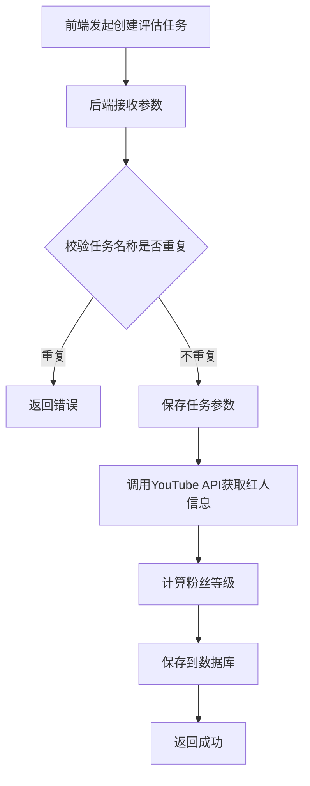
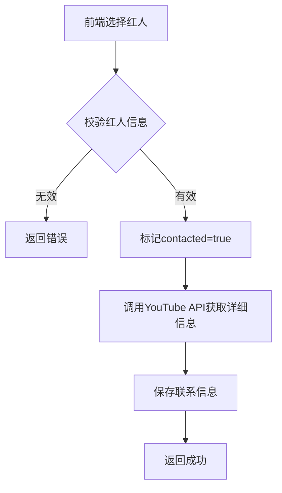

# 旧版后端技术方案

> **请将旧版后端技术方案粘贴到此处**  
> 包括：API 接口文档、数据库表结构、架构说明等

---

## 粘贴区域

# YouTube 红人搜索与评估系统技术方案

## 文档版本历史

| 版本 | 变更人 | 变更内容 | 变更时间 |
|------|--------|----------|----------|
| v1 | Ro | 设计初版流程 | 2025年12月31日 |
| v2 | Ro | 测分会议讨论需添加的内容<br>• 红人搜索列表<br>• 红人评估列表<br>• 数据库变更 | 2026年1月13日 |

## 1. 系统概述

本系统是一个YouTube红人搜索与评估平台，主要功能包括：
- 按关键词或红人ID搜索YouTube频道
- 创建红人评估任务
- 生成红人评估报告
- 管理红人联络列表

---

## 2. 数据库设计

### 2.1 spider_record表变更

**新增字段：**

```sql
-- 添加任务名称字段
ALTER TABLE youtube.spider_record 
ADD task_name varchar(100) NULL 
COMMENT '任务名称';

-- 添加创建人字段
ALTER TABLE youtube.spider_record 
ADD creator varchar(32) NULL 
COMMENT '创建人';
```

### 2.2 youtube_channel_rate表变更

**新增字段：**

```sql
-- 添加标记红人是否被联系过的字段
ALTER TABLE youtube.youtube_channel_rate 
ADD COLUMN contacted char 
COMMENT '标记红人是否被联系过';

-- 添加粉丝数量等级字段
ALTER TABLE youtube.youtube_channel_rate 
ADD COLUMN subscriber_cnt_level varchar(32) 
COMMENT '粉丝数量等级';

-- 添加头像字段
ALTER TABLE youtube.youtube_channel_rate 
ADD COLUMN avatar varchar(100) 
COMMENT '头像';

-- 添加uuid索引
CREATE INDEX uuid_IDX USING BTREE 
ON youtube.youtube_channel_rate (uuid);
```

### 2.3 新建映射表

**创建红人搜索任务和红人评估任务的UUID映射表：**

```sql
CREATE TABLE `spider_search_rate_mapping` (
  `id` bigint NOT NULL AUTO_INCREMENT COMMENT '主键',
  `channel_search_uuid` varchar(64) CHARACTER SET utf8mb4 COLLATE utf8mb4_general_ci DEFAULT NULL 
    COMMENT '红人搜索任务id',
  `channel_rate_uuid` varchar(64) CHARACTER SET utf8mb4 COLLATE utf8mb4_general_ci DEFAULT NULL 
    COMMENT '红人评估任务id',
  PRIMARY KEY (`id`)
) ENGINE=InnoDB DEFAULT CHARSET=utf8mb4 COLLATE=utf8mb4_general_ci;
```

---

## 3. 核心业务流程

### 3.1 创建评估任务流程



### 3.2 批量添加红人到联络列表流程



---

## 4. API接口设计

### 4.1 登录模块

#### 4.1.1 用户登录

**接口路径：** `/auth/login`  
**请求方法：** `POST`  
**接口描述：** 用户登录认证

**请求参数：**
```json
{
  "clientId": "",      // 客户端id
  "grantType": "",     // 授权类型
  "tenantId": "",      // 租户ID
  "code": "",          // 验证码
  "uuid": ""           // 唯一标识
}
```

**响应示例：**
```json
{
  "code": 200,
  "msg": "操作成功",
  "data": {
    "scope": null,
    "openid": null,
    "access_token": "eyJ0eXAiOiJKV1QiLCJhbGciOi...",
    "refresh_token": null,
    "expire_in": 604799,
    "refresh_expire_in": null,
    "client_id": "e5cd7e4891bf95d1d19206ce24a7b32e"
  }
}
```

#### 4.1.2 获取个人资料

**接口路径：** `/system/user/profile`  
**请求方法：** `GET`  
**接口描述：** 获取当前登录用户信息

**请求参数：** 无

**响应示例：**
```json
{
  "code": 200,
  "msg": "操作成功",
  "data": {
    "user": {
      "userId": 1,
      "tenantId": "000000",
      "deptId": 103,
      "userName": "admin",
      "nickName": "admin",
      "userType": "sys_user",
      "email": "crazyLionLi@163.com",
      "phonenumber": "18476470776",
      "sex": "1",
      "avatar": "",
      "status": "0",
      "loginIp": "103.197.28.111",
      "loginDate": "2026-01-05 11:37:34",
      "remark": "管理员",
      "createTime": "2024-03-13 07:00:25"
    },
    "roleGroup": "超级管理员",
    "postGroup": "董事长"
  }
}
```

#### 4.1.3 退出登录

**接口路径：** `/auth/logout`  
**请求方法：** `POST`  
**接口描述：** 退出登录

**请求参数：** 无

**响应示例：**
```json
{
  "code": 0,
  "data": {},
  "msg": "success"
}
```

---

### 4.2 项目管理模块

#### 4.2.1 项目列表

**接口路径：** `/project/project/userReportOption`  
**请求方法：** `GET`  
**接口描述：** 获取用户的项目列表

**请求参数：** 无

**响应示例：**
```json
{
  "code": 200,
  "msg": "操作成功",
  "data": {
    "projectList": [
      {
        "projectId": 2,
        "projectName": "GOC Demo Data New",
        "iconUrl": "https://storage.googleapis.com/gocresource/2025/09/28/fa104ddb645d4865b411ec4fcf7ded93.png",
        "adsCostReport": true,
        "biReport": true,
        "userReportPredictInfo": {
          "recall": "90.909",
          "precision": "0.08",
          "originPrecision": "0.03",
          "precisionIncrease": "2.5"
        },
        "algorithmList": [
          {
            "algorithmId": 22,
            "algorithmName": "AI 2.0",
            "startDate": "2025-05-31",
            "endDate": "2025-07-31"
          }
        ],
        "hasWaring": false
      }
    ]
  }
}
```

---

### 4.3 红人搜索模块

#### 4.3.1 按关键词搜索

**接口路径：** `/spider/youtube/search`  
**请求方法：** `POST`  
**接口描述：** 创建按关键词搜索红人的任务

**请求参数：**
```json
{
  "execute_type": "channel_search",     // 任务类型，固定写法
  "project_id": "",                     // 项目ID
  "task_name": "",                      // 任务名称
  "keywords": "test",                   // 行业关键词
  "video_max_result": 50,               // 单个关键词搜索视频数
  "order": "viewCount",                 // 排序方式：viewCount/date/rating/relevance
  "brand_name": "test",                 // 品牌关键词
  "competing_product": "test",          // 竞品关键词
  "prefer_country": "",                 // 国家偏好
  "channel_search_type": "channel",     // 检索维度：channel/video/excel
  "min_subscribers": 200                // 最小粉丝数
}
```

**国家偏好枚举值：**
- `NORTH_AMERICAN` - 北美
- `EUROPE` - 欧洲
- `CENTRAL_ASIA` - 中亚
- `AE` - 阿联酋
- `SA` - 沙特阿拉伯
- `FR` - 法国
- `DE` - 德国
- `JP` - 日本
- `US` - 美国
- `MX` - 墨西哥
- `UA` - 乌克兰
- `VN` - 越南
- `ES` - 西班牙
- `GB` - 英国
- `IT` - 意大利
- `AU` - 澳大利亚

**响应示例：**
```json
{
  "code": 0,
  "data": {
    "uuid": "ba8c51484269428ba8b0e69582ebf837"
  },
  "msg": "success"
}
```

**后端处理逻辑：**
- 添加创建人信息
- 判断项目下任务名称是否重复
- 将任务的param参数中的searchWay设置为`keywords`

#### 4.3.2 按红人ID搜索

**接口路径：** `/spider/youtube/excel_search`  
**请求方法：** `POST`  
**接口描述：** 创建按红人ID搜索红人的任务

**请求参数：** FormData
```
file: [Excel文件]
project_id: 1
task_name: ""                    // 任务名称
keywords: ""                     // 以逗号分隔的字符串
brand_name: ""                   // 以逗号分隔的字符串
competing_product: ""            // 以逗号分隔的字符串
```

**响应示例：**
```json
{
  "code": 0,
  "data": {
    "brand_name": ["test"],
    "channel_count": 0,
    "competing_product": ["test"],
    "key_words": ["test"],
    "uuid": "06f9671942ac4d8eafc54a4d69f567ca"
  },
  "msg": "success"
}
```

**后端处理逻辑：**
- 添加创建人信息
- 判断项目下任务名称是否重复
- 将任务的param参数中的searchWay设置为`channelId`

#### 4.3.3 任务列表

**接口路径：** `/project/spiderRecord/list`  
**请求方法：** `GET`  
**接口描述：** 获取红人搜索任务列表

**请求参数：**
```
?projectId=1
&spiderType=channel_search       // 任务类型，固定写法
&keyword=test                    // 任务名称或创建人
&pageNum=1
&pageSize=10
```

**响应示例：**
```json
[
  {
    "uuid": "ba8c51484269428ba8b0e69582ebf837",  // 红人搜索任务ID
    "taskName": "test1",                         // 任务名称
    "searchWay": "channelId",                    // 搜索方式
    "status": "success",                         // 任务状态
    "createTime": "2026-01-05 10:49:54",        // 创建时间
    "creator": "Robin"                           // 创建人
  }
]
```

**searchWay枚举值：**
- `channelId` - 按红人ID
- `keywords` - 按关键字

**status枚举值：**
- `init` - 初始化
- `success` - 成功
- `running` - 运行中
- `error` - 失败

#### 4.3.4 国家下拉列表

**接口路径：** `/project/channelInfo/countryList/{uuid}`  
**请求方法：** `GET`  
**接口描述：** 获取指定搜索任务的国家筛选列表

**路径参数：**
- `uuid` - 红人搜索任务ID

**响应示例：**
```json
{
  "code": 200,
  "msg": "",
  "data": ["美国", "中国"]
}
```

#### 4.3.5 查看搜索结果

**接口路径：** `/project/channelInfo/list`  
**请求方法：** `GET`  
**接口描述：** 查看红人搜索结果

**请求参数：**
```
?uuid=asdaasdad                           // 红人搜索任务ID
&subscriberCntLevel=MEGA                  // 粉丝量级
&country=美国                              // 国家
&orderBy=subscriber_count                 // 排序字段
&orderType=desc                           // 排序方式
```

**粉丝量级枚举值：**
- `MEGA` - 超大型
- `TOP` - 顶级
- `MACRO` - 大型
- `MID_UP` - 中上
- `MID` - 中型
- `MICRO_UP` - 微型偏上
- `MICRO` - 微型
- `NANO` - 纳米

**排序字段枚举值：**
- `subscriber_count` - 粉丝数
- `video_count` - 视频数
- `view_count` - 总观看次数
- `avg_views` - 平均观看次数

**排序方式枚举值：**
- `desc` - 降序
- `asc` - 升序

**响应示例：**
```json
[
  {
    "channelId": "",                                    // 频道id
    "channelTitle": "",                                 // 红人名称
    "avatar": "",                                       // 头像
    "homepage": "https://youtube.com/@ourfavoritefinds", // 主页链接
    "subscriberCount": 1,                               // 粉丝数
    "country": "美国",                                   // 国家
    "videoCount": 1,                                    // 视频数
    "viewCount": 1,                                     // 总观看次数
    "avgViews": 1,                                      // 平均观看量
    "matchedKeywords": "",                              // 匹配关键词
    "seoKeywords": "",                                  // SEO关键词
    "description": ""                                   // 频道简介
  }
]
```

#### 4.3.6 导出搜索结果

**接口路径：** `/spider/download`  
**请求方法：** `POST`  
**接口描述：** 导出红人搜索结果

**请求参数：** FormData
```
uuid: ba8c51484269428ba8b0e69582ebf837
```

**响应：** Excel文件下载

#### 4.3.7 任务详情

**接口路径：** `/project/spiderRecord/detail/{id}`  
**请求方法：** `GET`  
**接口描述：** 获取红人搜索任务详情

**路径参数：**
- `id` - 任务ID

**响应示例：**
```json
{
  "taskName": "",                    // 任务名称
  "searchWay": "",                   // 搜索方式
  "creator": "",                     // 创建人
  "createTime": "",                  // 创建时间
  "status": "",                      // 状态
  "keywords": "",                    // 行业关键词
  "brandName": "",                   // 品牌关键词
  "competingProduct": "",            // 竞品关键词
  "videoMaxResult": "",              // 单个视频搜索数
  "order": "",                       // 排序方式
  "channelSearchType": "",           // 检索维度
  "preferCountry": "",               // 国家偏好
  "minSubscribers": ""               // 最小粉丝数
}
```

#### 4.3.8 重命名任务

**接口路径：** `/project/spiderRecord`  
**请求方法：** `PUT`  
**接口描述：** 重命名红人搜索任务

**请求参数：**
```json
{
  "id": 1222,
  "taskName": "",                    // 任务名称
  "spiderType": "channel_search"     // 任务类型，固定写法
}
```

**响应示例：**
```json
{
  "code": 200,
  "msg": "",
  "data": null
}
```

**后端处理逻辑：**
- 判断项目下任务名称是否重复

---

### 4.4 红人评估模块

#### 4.4.1 获取默认评估任务名称

**接口路径：** `/project/spiderRecord/getDefaultEvaluateTaskName/{uuid}`  
**请求方法：** `GET`  
**接口描述：** 获取默认评估任务名称

**路径参数：**
- `uuid` - 红人搜索任务ID

**请求参数：**
```
?projectId=2
```

**响应示例：**
```json
{
  "code": 200,
  "data": "评估1-割草机红人评估",
  "msg": ""
}
```

#### 4.4.2 创建评估任务

**接口路径：** `/project/spiderRecord/addChannelEvaluateTask`  
**请求方法：** `POST`  
**接口描述：** 创建评估任务

**请求参数：**
```json
{
  "projectId": 1,
  "searchTaskUuid": "",              // 红人搜索任务的uuid
  "taskName": "",                    // 任务名称
  "p0channelType": "",               // P0红人类型
  "p1channelType": "",               // P1红人类型
  "p2channelType": "",               // P2红人类型
  "channelInfoIds": [1, 2, 3, 4]    // 红人信息ID列表
}
```

**响应示例：**
```json
{
  "code": 200,
  "msg": "",
  "data": null
}
```

**后端处理逻辑：**
- 判断项目下任务名称是否重复
- 写入粉丝数等级

#### 4.4.3 评估任务列表

**接口路径：** `/project/spiderRecord/list`  
**请求方法：** `GET`  
**接口描述：** 获取红人评估任务列表

**请求参数：**
```
?projectId=1
&spiderType=channel_rate           // 任务类型，固定写法
&keyword=                          // 任务名称或创建人
&pageNum=1
&pageSize=10
```

**响应示例：**
```json
[
  {
    "uuid": "",                              // 红人评估任务ID
    "taskName": "",                          // 任务名称
    "evaluateChannelCnt": "",                // 红人数量
    "channelTypeParam": {
      "p0channelType": "xxx1,xxx2",
      "p1channelType": "xxx3,xxx4",
      "p2channelType": "xxx5,xxx6"
    },
    "status": "",                            // 状态
    "createTime": "",                        // 创建时间
    "creator": ""                            // 创建人
  }
]
```

#### 4.4.4 国家下拉列表

**接口路径：** `/project/channelRate/countryList/{uuid}`  
**请求方法：** `GET`  
**接口描述：** 获取评估任务的国家筛选列表

**路径参数：**
- `uuid` - 红人评估任务ID

**响应示例：**
```json
{
  "code": 200,
  "msg": "",
  "data": ["美国"]
}
```

#### 4.4.5 红人类型下拉列表

**接口路径：** `/project/channelRate/channelTypeList/{uuid}`  
**请求方法：** `GET`  
**接口描述：** 获取评估任务的红人类型筛选列表

**路径参数：**
- `uuid` - 红人评估任务ID

**响应示例：**
```json
{
  "code": 200,
  "msg": "",
  "data": ["工具 / DIY / 家装工具"]
}
```

#### 4.4.6 查看评估报告

**接口路径：** `/project/channelRate/list`  
**请求方法：** `POST`  
**接口描述：** 查看红人评估任务报告

**请求参数：**
```json
{
  "uuid": "aaa",                         // 红人评估任务ID
  "minQualityScore": 1,                  // 最小质量得分
  "maxQualityScore": 99,                 // 最大质量得分
  "minBizMatchingScore": 1,              // 最小业务匹配度
  "maxBizMatchingScore": 99,             // 最大业务匹配度
  "minRecAvgViewCnt": 1,                 // 最小均播
  "maxRecAvgViewCnt": 3,                 // 最大均播
  "minPredictCpm": 1,                    // 最小预估cpm
  "maxPredictCpm": 2,                    // 最大预估cpm
  "minBrVideoCnt": 1,                    // 最小商单数量
  "maxBrVideoCnt": 2,                    // 最大商单数量
  "subscriberCntLevel": "MEGA,TOP",      // 粉丝量级
  "country": "美国,中国",                 // 国家
  "channelTypeList": ["工具 / DIY / 家装工具", "智能出行 / 电动出行"],
  "orderBy": "subscriber_count",         // 排序字段
  "orderType": "desc"                    // 排序方式
}
```

**排序字段枚举值：**
- `channel_quality_score` - 质量评估
- `biz_matching_score` - 红人业务匹配度
- `rec_avg_view_cnt` - 近10条视频均播
- `rec_engagement_rate` - 互动率
- `rec_br_video_cnt` - 商单数量
- `predict_cpm` - 预估cpm
- `suggested_quotation` - 建议报价
- `video_cnt_in90d` - 近3个月视频数
- `rec_median_view_cnt` - 近10条视频观看量中位数
- `rec_short_video_cnt` - 近10条短视频
- `rec_long_video_cnt` - 近10条长视频
- `rec_br_avg_view_cnt` - 商单均播
- `rec_br_median_view_cnt` - 商单播放量中位数
- `rec_br_top_eng_rate` - 商单最高互动率
- `rec_br_top_view_cnt` - 商单最高观看量
- `bv_avg_ratio` - 商单均播占比

**响应示例：**
```json
[
  {
    "id": 1,
    "projectId": 1,                                     // 项目id
    "channelId": "",                                    // 红人id
    "avatar": "",                                       // 头像
    "channelTitle": "",                                 // 红人名称
    "homepage": "https://youtube.com/@ourfavoritefinds", // 主页信息
    "subscriberCntLevel": "",                           // 粉丝量级
    "country": "",                                      // 国家
    "channelType": "",                                  // 红人类型
    "channelQualityScore": 1,                           // 质量评估
    "bizMatchingScore": 1,                              // 红人业务匹配度
    "recAvgViewCnt": 1,                                 // 近10条视频均播
    "recEngagementRate": 1.0,                           // 互动率
    "recBrVideoCnt": 1,                                 // 商单数量
    "predictCpm": "",                                   // 预估cpm
    "suggestedQuotation": "",                           // 建议报价
    "videoCntIn90d": 1,                                 // 近3个月视频数
    "recMedianViewCnt": 1,                              // 近10条视频观看量中位数
    "recShortVideoCnt": 1,                              // 近10条短视频
    "recLongVideoCnt": 1,                               // 近10条长视频
    "recBrAvgViewCnt": 1,                               // 商单均播
    "recBrMedianViewCnt": 1,                            // 商单播放量中位数
    "recBrTopEngRate": 1.0,                             // 商单最高互动率
    "recBrTopViewCnt": 1,                               // 商单最高观看量
    "bvAvgRatio": 1.0,                                  // 商单均播占比
    "recBrLink": "",                                    // 近10条视频中，商单视频的链接
    "contacted": true                                   // 是否联络过
  }
]
```

#### 4.4.7 导出评估报告

**接口路径：** `/spider/download`  
**请求方法：** `POST`  
**接口描述：** 导出评估报告

**请求参数：** FormData
```
uuid: 520714e3317749c29828f8e9be6b6895
```

**响应：** Excel文件下载

#### 4.4.8 批量添加红人到联络列表

**接口路径：** `/project/channelRate/contactChannels`  
**请求方法：** `POST`  
**接口描述：** 批量添加红人到联络列表

**请求参数：**
```json
[
  {
    "id": 1,
    "channelId": "SYWDSXXS"
  }
]
```

**响应示例：**
```json
{
  "code": 200,
  "msg": "",
  "data": {}
}
```

**后端处理逻辑：**
- 将红人的contacted属性设置为true

#### 4.4.9 重命名评估任务

**接口路径：** `/project/spiderRecord`  
**请求方法：** `PUT`  
**接口描述：** 评估报告重命名

**请求参数：**
```json
{
  "id": 1222,
  "taskName": "",                    // 任务名称
  "spiderType": "channel_rate"       // 任务类型
}
```

**响应示例：**
```json
{
  "code": 200,
  "msg": "",
  "data": null
}
```

**后端处理逻辑：**
- 判断项目下任务名称是否重复

---

### 4.5 红人联络模块

#### 4.5.1 联络列表

**接口路径：** `/project/channelRate/list`  
**请求方法：** `GET`  
**接口描述：** 红人联络列表

**请求参数：**
```
?projectId=1
&contacted=true
```

**响应示例：**
```json
[
  {
    "channelId": "",                                    // 红人ID
    "channelTitle": "",                                 // 红人名称
    "subscriberCount": "",                              // 订阅数
    "avatar": "",                                       // 头像
    "country": "",                                      // 国家
    "email": "",                                        // 联系邮箱
    "predictCpm": "",                                   // 预估cpm
    "suggestedQuotation": "",                           // 建议报价
    "homepage": "https://youtube.com/@ourfavoritefinds" // handle
  }
]
```

#### 4.5.2 导出联络列表

**接口路径：** `/project/channelRate/export`  
**请求方法：** `POST`  
**接口描述：** 导出联络列表

**请求参数：**
```json
{
  "projectId": 1,
  "contacted": true
}
```

**响应：** Excel文件下载

**后端处理逻辑：**
- 导出所有contacted属性为true的数据

#### 4.5.3 移除红人

**接口路径：** `/project/channelRate/removeContact/{ids}`  
**请求方法：** `POST`  
**接口描述：** 移除红人

**请求参数：**
```
1,2,3
```

**响应示例：**
```json
{
  "code": 200,
  "msg": "",
  "data": {}
}
```

**后端处理逻辑：**
- 将记录的contacted属性设置为false

---

## 5. 数据结构说明

### 5.1 粉丝量级（subscriber_cnt_level）

| 等级 | 名称 | 粉丝数范围 |
|------|------|-----------|
| MEGA | 超大型 | 1000万+ |
| TOP | 顶级 | 100万-1000万 |
| MACRO | 大型 | 50万-100万 |
| MID_UP | 中上 | 10万-50万 |
| MID | 中型 | 5万-10万 |
| MICRO_UP | 微型偏上 | 1万-5万 |
| MICRO | 微型 | 5000-1万 |
| NANO | 纳米 | 5000以下 |

### 5.2 任务状态（status）

| 状态值 | 说明 |
|--------|------|
| init | 初始化 |
| running | 运行中 |
| success | 成功 |
| error | 失败 |

### 5.3 搜索方式（searchWay）

| 值 | 说明 |
|----|------|
| keywords | 按关键字搜索 |
| channelId | 按红人ID搜索 |

### 5.4 任务类型（spiderType）

| 值 | 说明 |
|----|------|
| channel_search | 红人搜索任务 |
| channel_rate | 红人评估任务 |

---

## 6. 业务规则

### 6.1 任务命名规则

- 任务名称在同一项目下必须唯一
- 创建任务时后端会自动校验名称重复性
- 重命名任务时也需要进行重复性校验

### 6.2 红人联络管理

- 通过`contacted`字段标记红人是否已联络
- 添加到联络列表时，将`contacted`设置为`true`
- 从联络列表移除时，将`contacted`设置为`false`
- 联络列表只显示`contacted=true`的红人

### 6.3 评估任务创建规则

- 必须基于已有的红人搜索任务
- 通过`searchTaskUuid`关联搜索任务
- 自动计算并存储粉丝数量等级
- 支持设置P0、P1、P2三个优先级的红人类型

### 6.4 排序规则

- 支持升序（asc）和降序（desc）
- 默认按降序排列
- 可按多个维度排序（粉丝数、观看量、互动率等）

---

## 7. 接口变更记录

### 7.1 红人搜索列表接口变更

**接口：** `/project/channelInfo/list`

**变更内容：**
- 添加`orderBy`参数：排序字段
- 添加`orderType`参数：排序方式

### 7.2 红人评估列表接口变更

**接口：** `/project/channelRate/list`

**变更内容：**
- 添加国家下拉列表接口：`/project/channelInfo/countryList/{uuid}`
- 添加默认评估任务名称接口：`/project/spiderRecord/getDefaultEvaluateTaskName/{uuid}`
- 查看红人评估任务报告接口添加排序：添加`orderBy`和`orderType`参数

### 7.3 数据库变更

**新增映射表：**
- `spider_search_rate_mapping` - 红人搜索任务和红人评估任务的UUID映射表

---

## 8. 注意事项

### 8.1 前端开发注意事项

1. **参数命名规范**
   - 统一使用下划线命名（snake_case）
   - 例如：`project_id`、`task_name`、`channel_search_type`

2. **分页处理**
   - 部分接口已移除分页参数，返回全部数据
   - 需要在前端进行虚拟滚动或前端分页

3. **文件上传**
   - 使用FormData格式
   - 注意文件大小限制

4. **错误处理**
   - 所有接口都应处理错误情况
   - 失败任务需要显示失败原因（待定）

### 8.2 后端开发注意事项

1. **权限控制**
   - 所有接口都需要登录认证
   - 项目数据需要进行权限校验

2. **数据校验**
   - 任务名称唯一性校验
   - 参数有效性校验
   - 业务逻辑校验

3. **数据一致性**
   - 使用事务确保数据一致性
   - 维护UUID映射关系

4. **性能优化**
   - 添加必要的数据库索引
   - 使用缓存优化查询性能

---

## 9. 技术栈

### 9.1 后端技术

- **框架：** Spring Boot
- **数据库：** MySQL（youtube库）
- **字符集：** UTF-8MB4
- **引擎：** InnoDB

### 9.2 第三方API

- **YouTube Data API：** 用于获取YouTube频道和视频信息

---

## 10. 开发进度

### 10.1 已完成功能

- ✅ 数据库设计
- ✅ 登录模块
- ✅ 项目列表
- ✅ 红人搜索功能
- ✅ 红人评估功能
- ✅ 红人联络管理

### 10.2 待开发功能

- ⏳ 失败任务的失败原因展示
- ⏳ 性能优化
- ⏳ 测试完善

---

## 附录：字段映射表

### A.1 接口参数名称变更历史

| 旧参数名 | 新参数名 | 变更日期 | 备注 |
|---------|---------|----------|------|
| projectId | project_id | 2026-01-09 | 统一命名规范 |
| taskName | task_name | 2026-01-09 | 统一命名规范 |
| brand_name | brandName | 2026-01-08 | 驼峰命名 |
| type | spiderType | 2026-01-08 | 更明确的命名 |
| channelInfo | channelInfoList | 2026-01-08 | 改为数组 |
| channelInfoList | channelRateList | 2026-01-08 | 更准确的命名 |
| channelRateList | channelInfoIds | 2026-01-20 | 只传ID数组 |

### A.2 接口路径变更历史

| 旧路径 | 新路径 | 变更日期 | 备注 |
|-------|--------|----------|------|
| /project/channelInfo/getChannelSearchRes | /project/channelInfo/list | 2026-01-09 | 简化路径 |
| /project/channelRate/export | /spider/download | 2026-01-07 | 统一导出接口 |
| /project/spiderRecord/detail | /project/spiderRecord/detail/{id} | 2026-01-08 | RESTful风格 |

---

**文档结束**

*最后更新时间：2026年1月26日*

---

## 备注

粘贴完成后，我会帮你：
1. 与新版需求（BACKEND_GUIDE.md）对比
2. 标记可复用 vs 需修改 vs 需新增的部分
3. 生成详细的改造方案
